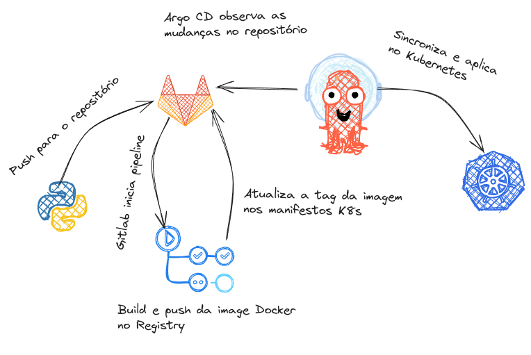

# DMARC Exporter

## Fluxo do CI e publicação



## Protegendo os segredos com Sealed Secrets

Crie um arquivo `.env`.

```
cp .env-example .env
```

Utilize os valores configurados no `.env` para selar os segredos

```
K8S_ENVIRONMENT=staging;kubectl create secret -n ${K8S_ENVIRONMENT}-dmarc-exporter generic dmarc-exporter-secret --dry-run=client --from-env-file=.env.${K8S_ENVIRONMENT} -o yaml | \
kubeseal --controller-name=sealed-secrets-controller --controller-namespace=sealed-secrets --format yaml > k8s/overlays/${K8S_ENVIRONMENT}/dmarc-exporter-sealedsecret.yaml
```

## Referências
