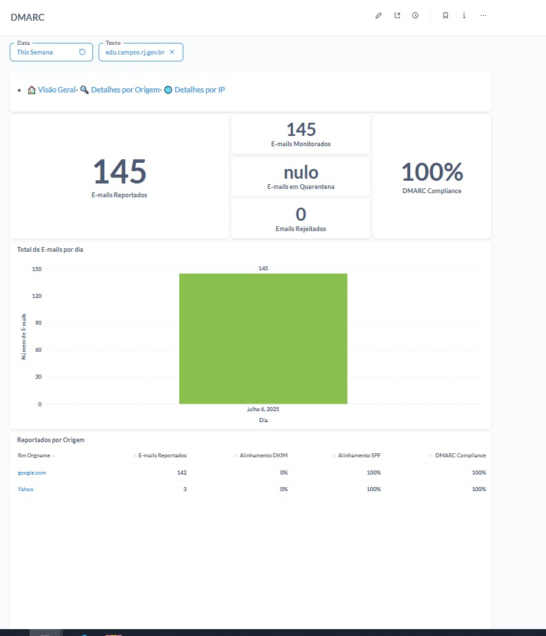
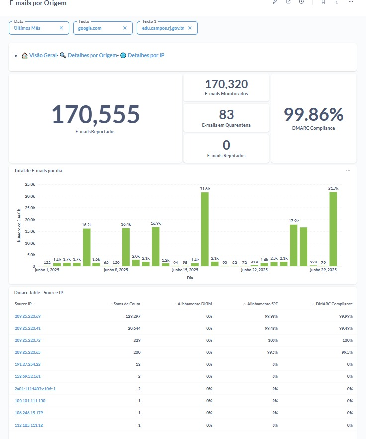
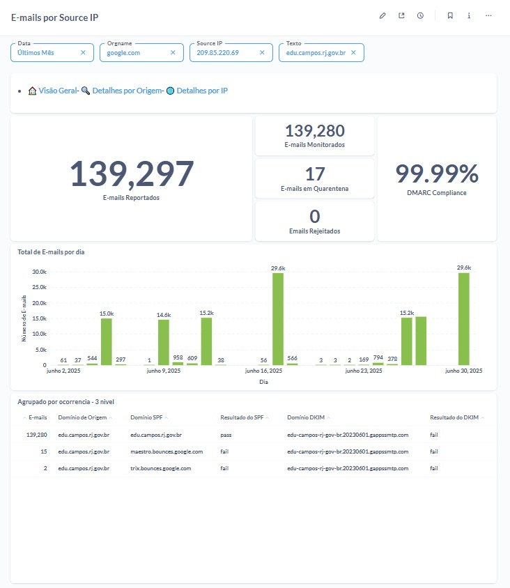

# 📊 Projeto de Monitoramento DMARC – edu.campos.rj.gov.br

Este projeto tem como objetivo a visualização e análise dos relatórios de conformidade DMARC do domínio **edu.campos.rj.gov.br**, utilizando painéis de Business Intelligence (BI) para oferecer insights claros sobre autenticação de e-mails, segurança e alinhamento com SPF/DKIM.

## 💡 Objetivo

Monitorar a integridade dos e-mails enviados em nome do domínio institucional, assegurando que estão protegidos contra spoofing e falsificações, de acordo com as diretrizes DMARC. O painel também visa facilitar a análise de conformidade por origem e IP.

---

## 📌 Funcionalidades

* Visualização de métricas DMARC (e-mails monitorados, rejeitados, em quarentena).
* Análise de conformidade por **origem** (como Google e Yahoo).
* Detalhamento por **IP de origem** com visualização diária do volume de e-mails.
* Identificação de falhas nos alinhamentos **SPF** e **DKIM**.
* Conformidade global e segmentada com as políticas DMARC.

---

## 📷 Capturas de Tela

### 1. Visão Geral da Semana Atual

* 145 e-mails reportados.
* 100% de conformidade DMARC.
* Origem principal: `google.com`.

### 2. Análise Mensal por Origem

* 170.555 e-mails analisados.
* Principais IPs e volumes diários.
* 99,86% de conformidade DMARC.

### 3. Detalhes por IP 

* IP principal do Google.
* 139.280 e-mails enviados.
* Falha no alinhamento DKIM, apesar de SPF aprovado.

---

## 🛠️ Tecnologias Utilizadas

* Ferramenta de BI(Metabase)
* Protocolo **DMARC** com suporte a **SPF** e **DKIM**
* Processamento de relatórios XML agregados 
* Scripts para parsing e transformação dos dados (Python, Pandas)

---

## 📈 Métricas de Sucesso

* Alcançar **99%+ de conformidade DMARC** em e-mails legítimos.
* Redução de falsificações ou e-mails não autorizados.
* Monitoramento ativo de remetentes autorizados e análise contínua de reputação.

---

## 🧩 Possíveis Melhorias Futuras

* Integração com alertas em tempo real para falhas de alinhamento.
* Automação de parsing e inserção dos dados via pipeline.
* Expansão para outros domínios institucionais do município.

